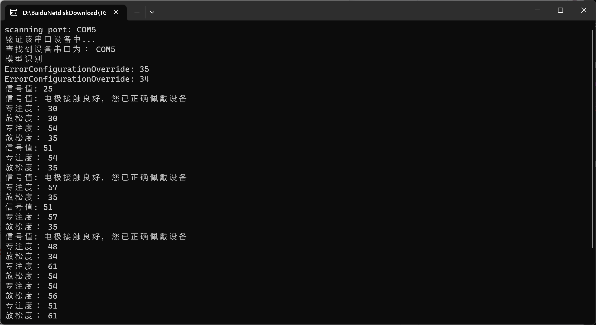

# Devices Introduction
In this dataset, EEG data are acquisited through six different devices: EMOTIV EPOC+, BrainLink, TGAM, OpenBCI, UmindSleep and UmindLite. The following is the instroduction and websites of the deivce usage.

## TGAM
* TGAM is the production of Neurosky. 
* It's a sigle channel EEG device with the sample rate of 512Hz.
* Please check the company's [website](http://www.neurosky.com.cn/products-markets/eeg-biosensors/hardware/) for more information.
### How to connect TGAM
A demo written with C# is in /DeviceConnect/TGAM/WindowsFormsApp1. To run the solution, please follow this instruction.
1. Make sure that you have already installed the [Visual Studio 2019](https://visualstudio.microsoft.com/)
2. Make sure that you have the following workloads: [.NET desktop development](https://visualstudio.microsoft.com/vs/features/net-development/)
3. Clone this responsitry to your local computer use 
```
git clone https://github.com/TJ-ACLAB/FAT-WAKE.git
```
4. Open the /DeviceConnect/TGAM/WindowsFormsApp1/WindowsFormsApp1.sln by directly click it twice.
5. Click the "Start" and you can see the following cmd windows

If your cmd window performs as the following, your connection to the TGAM is success. And the data is writing to the result file.

However if your cmd cmd window stuck like this:

That means your signal quality is poor. Please wipe the electrodes, bilateral earlobes and all areas of skin in contact with the electrodes with a wet wipe to ensure that the contact points are free of oil and sweat.
If you can see the cmd windows with the port detected, than you can skip the following steps.
### How to Install USB Driver
1. If your cmd window is like this: 

Unfortunately, you have something wrong with your USB driver.
First check your Device manager:
```
Win+R
```
type the following
```
devmgmt.msc
```  
- click "PORT(COM and LPT)" check if there is something like "USB-SERIAL CH340(COMX)" If there is not, you may try to change your USB port.
- If There is a triangle yellow exclamation mark you have to install the driver for USB
2. Install driver of USB
- Insert your bluetooch reciever to computer.
- Open /DeciveConnect/TGAM/CH340USB double click SETUP64.exe
- click "INSTALL" 
3. If the Driver problem could still not be solved please refer to this [link](https://blog.csdn.net/m0_52242552/article/details/126219464) and follow the instruction.
### Change Result Files Name
* The result of your EEG signals will be stored in the file  "DeviceConnect/TGAM/WindowsFormsApp1/WindowsFormsApp1/bin/Debug/TGMARaw.txt". Please change the file's name every time after you start the C# debugger, otherwsie your previous data will be overwirtten.
